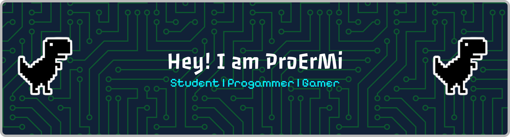

# Hello Everyone 👋

  

<!--  -->

<h2 align="center">Welcome to My Github Profile</h2>

## 💫 About Me 
I am a beginner programmer 🖥️, I'm still a student 🧑‍🎓. My hobbies is coding ⌨️ dan gaming 🎮. In my github profile, I make several project resulting from my coding.

- 🌱 I’m currently learning **HTML**, **CSS**,  **Javascript**, etc
- 🔭 I’m currently studying on university

## ⚙️ Skills 

## 📊 GitHub Stats:

## 🏆 GitHub Trophies

### ✍️ Random Dev Quote

## 📞 Contact Me 

  
  
  
  

###
